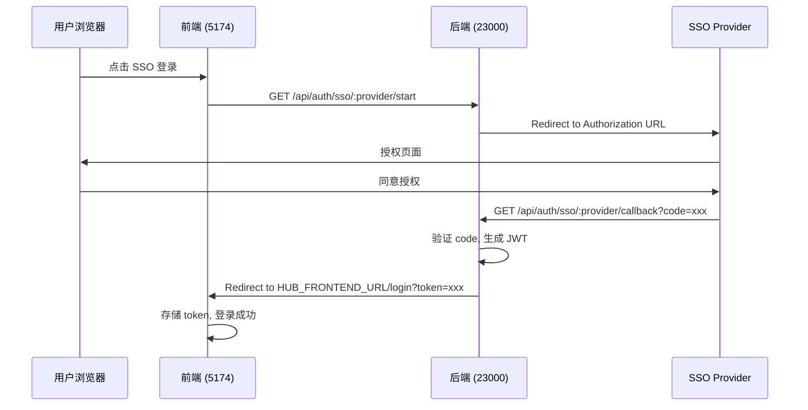

# SSO HTTPS Redirect 配置修复

## 问题描述
**日期**: 2025-12-18  
**影响组件**: NewmindHub Backend (SSO & Payment)

### 问题现象
- 前端启用 HTTPS 后，SSO 登录回调跳转失败
- 回调地址仍然使用 `http://` 协议
- 用户被重定向到错误的地址

### 根本原因
1. **硬编码的默认值**: SSO 回调代码中使用了错误的默认端口 `http://localhost:23001`（实际应该是 `5174`）
2. **环境变量未配置**: 用户的 `.env` 文件中可能没有正确配置 `HUB_FRONTEND_URL`
3. **协议不匹配**: 前端启用 HTTPS 后，后端回调仍然使用 HTTP 协议

---

## 解决方案

### 1. 代码修复

#### 修复 SSO 回调地址（`src/routes/sso.js`）
**修改前**：
```javascript
const hubFrontendUrl = process.env.HUB_FRONTEND_URL || 'http://localhost:23001';
```

**修改后**：
```javascript
const hubFrontendUrl = process.env.HUB_FRONTEND_URL || 'http://localhost:5174';
```

**影响位置**：
- 第 88 行：OAuth 错误回调
- 第 144 行：登录成功回调  
- 第 157 行：异常错误回调

### 2. 环境变量配置

#### 更新 `env.example`
添加清晰的 HTTPS 配置说明：

```bash
# Frontend Configuration
# 前端有自己的配置文件：frontend/.env
# 这里只配置后端需要知道的前端 URL（用于 SSO 回调、支付回调等）
# ⚠️ 重要：如果前端启用了 HTTPS，这里也必须改为 https://
HUB_FRONTEND_URL=http://localhost:5174
# HUB_FRONTEND_URL=https://localhost:5174  # 前端 HTTPS 时使用这个
```

---

## 配置步骤

### 步骤 1: 修改后端 .env 文件

```bash
# 编辑后端配置
vim /Users/xuhao/work/es/newsoft/newmind-ai/NewmindHub/.env
```

**根据前端配置选择协议**：

#### 选项 A: 前端使用 HTTPS（推荐）
```bash
# 后端 .env
ENABLE_HTTPS=true
SSL_CERT_FILE=ssl/cert.pem
SSL_KEY_FILE=ssl/key.pem
PORT=23000
HUB_FRONTEND_URL=https://localhost:5174  ← 使用 https://
```

```bash
# 前端 .env (frontend/.env)
VITE_ENABLE_HTTPS=true
VITE_SSL_CERT_FILE=ssl/cert.pem
VITE_SSL_KEY_FILE=ssl/key.pem
VITE_API_BASE_URL=https://localhost:23000  ← 使用 https://
```

#### 选项 B: 前端使用 HTTP（快速开发）
```bash
# 后端 .env
ENABLE_HTTPS=false
PORT=23000
HUB_FRONTEND_URL=http://localhost:5174  ← 使用 http://
```

```bash
# 前端 .env (frontend/.env)
VITE_ENABLE_HTTPS=false
VITE_API_BASE_URL=http://localhost:23000  ← 使用 http://
```

### 步骤 2: 确保配置文件中的拼写正确

⚠️ **常见错误**：
```bash
# ❌ 错误
ENABLE_HTTPS=ture  # 拼写错误

# ✅ 正确
ENABLE_HTTPS=true
```

### 步骤 3: 重启后端服务

```bash
cd /Users/xuhao/work/es/newsoft/newmind-ai/NewmindHub
npm start
```

### 步骤 4: 验证配置

#### 检查后端日志
```bash
# 应该显示正确的协议
🚀 NewmindHub server running on https://localhost:23000
🔒 HTTPS: Enabled
```

#### 测试 SSO 回调
1. 访问前端登录页面（如 https://localhost:5174/login）
2. 点击 SSO 登录（如 Google/Azure/企业微信）
3. 授权后应该正确跳转回前端，URL 应该是：
   ```
   https://localhost:5174/login?token=xxx
   ```

---

## 技术细节

### SSO 回调流程



### 环境变量依赖关系

| 配置项 | 使用位置 | 说明 |
|--------|----------|------|
| `HUB_FRONTEND_URL` | 后端 SSO/Payment 回调 | 后端需要知道前端地址以重定向用户 |
| `VITE_API_BASE_URL` | 前端 API 调用 | 前端需要知道后端地址 |
| `ENABLE_HTTPS` | 后端服务器 | 后端是否启用 HTTPS |
| `VITE_ENABLE_HTTPS` | 前端开发服务器 | 前端是否启用 HTTPS |

### 涉及的回调场景

1. **SSO 登录回调**
   - 成功：`${HUB_FRONTEND_URL}/login?token=xxx`
   - 失败：`${HUB_FRONTEND_URL}/login?error=xxx`

2. **Stripe 支付回调**
   - 成功：`${HUB_FRONTEND_URL}/payment/success?session_id=xxx`
   - 取消：`${HUB_FRONTEND_URL}/billing?cancelled=true`

3. **NewmindChat 集成**
   - 带应用重定向：`${HUB_FRONTEND_URL}/login?token=xxx&appRedirect=dive`

---

## 故障排查

### 问题 1: SSO 回调后浏览器显示连接被拒绝

**症状**：
```
https://localhost:5174/login?token=xxx
此网站无法访问 / ERR_CONNECTION_REFUSED
```

**原因**：
- `HUB_FRONTEND_URL` 配置了 HTTPS，但前端没有启用 HTTPS

**解决**：
```bash
# 方案 A: 前端启用 HTTPS（推荐）
# 编辑 frontend/.env
VITE_ENABLE_HTTPS=true

# 方案 B: 后端改用 HTTP 回调
# 编辑 NewmindHub/.env
HUB_FRONTEND_URL=http://localhost:5174
```

### 问题 2: 浏览器警告混合内容（Mixed Content）

**症状**：
```
Mixed Content: The page at 'https://localhost:5174' was loaded over HTTPS,
but requested an insecure XMLHttpRequest endpoint 'http://localhost:23000/api/...'
```

**原因**：
- 前端使用 HTTPS，但配置的后端 API 地址是 HTTP

**解决**：
```bash
# 编辑 frontend/.env
VITE_API_BASE_URL=https://localhost:23000  # 改为 https://
```

### 问题 3: SSO 回调 URL 仍然是 http://

**症状**：
- 修改了 `HUB_FRONTEND_URL=https://...`
- 但回调仍然跳转到 `http://...`

**排查步骤**：
1. 确认配置文件位置正确：
   ```bash
   # 应该是这个文件
   /Users/xuhao/work/es/newsoft/newmind-ai/NewmindHub/.env
   ```

2. 确认环境变量已加载：
   ```bash
   # 在后端代码中添加临时日志
   console.log('HUB_FRONTEND_URL:', process.env.HUB_FRONTEND_URL);
   ```

3. 重启后端服务：
   ```bash
   # 环境变量只在服务启动时加载
   npm start
   ```

### 问题 4: 自签名证书浏览器不信任

**症状**：
```
NET::ERR_CERT_AUTHORITY_INVALID
您的连接不是私密连接
```

**解决**：
1. 在浏览器中点击"高级"→"继续访问"（开发环境可接受）
2. 将自签名证书添加到系统信任列表（macOS）：
   ```bash
   sudo security add-trusted-cert -d -r trustRoot \
     -k /Library/Keychains/System.keychain \
     /Users/xuhao/work/es/newsoft/newmind-ai/NewmindHub/ssl/cert.pem
   ```

---

## 生产环境建议

### 1. 使用真实域名和证书
```bash
# 生产环境 .env
HUB_FRONTEND_URL=https://newmind.yourdomain.com
ENABLE_HTTPS=true
SSL_CERT_FILE=/etc/letsencrypt/live/yourdomain.com/fullchain.pem
SSL_KEY_FILE=/etc/letsencrypt/live/yourdomain.com/privkey.pem
```

### 2. 配置 HSTS（强制 HTTPS）
```javascript
// src/server.js
app.use(helmet({
  hsts: {
    maxAge: 31536000,  // 1 year
    includeSubDomains: true,
    preload: true
  }
}));
```

### 3. 使用环境变量验证
```javascript
// 在服务启动时检查必需的环境变量
const requiredEnvVars = ['HUB_FRONTEND_URL', 'JWT_SECRET', 'DATABASE_URL'];
for (const envVar of requiredEnvVars) {
  if (!process.env[envVar]) {
    logger.error(`Missing required environment variable: ${envVar}`);
    process.exit(1);
  }
}
```

### 4. SSO Provider 配置
不要忘记在 SSO Provider 管理后台更新回调 URL：

**Google OAuth**:
```
授权重定向 URI: https://yourdomain.com/api/auth/sso/google/callback
```

**Azure AD**:
```
重定向 URI: https://yourdomain.com/api/auth/sso/azure/callback
```

**企业微信**:
```
可信域名: yourdomain.com
回调地址: https://yourdomain.com/api/auth/sso/wechatwork/callback
```

---

## 相关文件变更

### 修改的文件
1. `NewmindHub/src/routes/sso.js`
   - 修改默认端口从 23001 → 5174
   - 3 处硬编码默认值更新

2. `NewmindHub/env.example`
   - 添加 HTTPS 配置说明
   - 添加注释示例

### 未修改但相关的文件
- `NewmindHub/src/routes/payment.js` - 也使用 `HUB_FRONTEND_URL`
- `NewmindHub/src/server.js` - CORS 配置

---

## 测试检查清单

- [ ] 后端 `.env` 中 `HUB_FRONTEND_URL` 协议正确（http/https）
- [ ] 前端 `.env` 中 `VITE_API_BASE_URL` 协议正确
- [ ] 后端 `ENABLE_HTTPS` 拼写正确（不是 `ture`）
- [ ] 前端 `VITE_ENABLE_HTTPS` 值正确
- [ ] 重启了后端和前端服务
- [ ] SSO 登录成功后正确跳转到前端
- [ ] 浏览器控制台无混合内容警告
- [ ] 支付回调测试（如果使用 Stripe）

---

## 相关文档

- [Frontend HTTPS 配置](./20251218_frontend_https_configuration.md)
- [HTTPS 快速启动](../NewmindHub/HTTPS_QUICK_START.md)
- [SSO 配置指南](../NewmindHub/SSO_CONFIG.md)

---

## 版本历史

- **v1.0** (2025-12-18): 初始版本
  - 修复 SSO 回调默认端口错误（23001 → 5174）
  - 添加 HTTPS 配置说明
  - 完善故障排查指南
